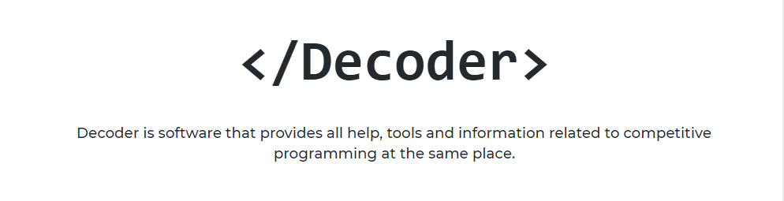

#### 🔴 **_Site Under Development_**



### Table of Contents
- [Decoder - A Competitive Programming Portal](#decoder---a-competitive-programming-portal)
- [Functionality](#functionality)
- [Installtion](#installtion)
- [Environment Variable Structure](#environment-variable-structure)
- [How to run ?](#how-to-run-)
- [Screenshots](#screenshots)

## Decoder - A Competitive Programming Portal
 - Decoder is software that provides all help, tools and information related to competitive programming at the same place. Decoder contains an online compiler for some of the languages, allowing users to share code with others by sharing a link to the code. Along with the compiler it has a stress testing environment which uses system automated test cases for your code and checks efficiency and correctness of your code against these test cases. This software will also utilise APIs provided by some known competitive programming platforms to fetch the details about upcoming contests and Rankings of students in our college. Decoder also has a discussion forum to discuss topics related to competitive programming. Users can ask doubts regarding any topics and other users can comment and reply. It'll also contain resources (links and references) to learn competitive programming. Link to university's coding clubs contest (previous as well as upcoming if there are any).

* This project uses the [MEAN stack](https://en.wikipedia.org/wiki/MEAN_(software_bundle)) :
  * [**M**ongoose.js](http://www.mongoosejs.com) ([MongoDB](https://www.mongodb.com)) : database
  * [**E**xpress.js](http://expressjs.com) : backend framework
  * [**A**ngular](https://angular.io) : frontend framework
  * [**N**ode.js](https://nodejs.org) : runtime environment

* Other tools and technologies used :
  * [Angular CLI](https://cli.angular.io) : frontend scaffolding
  * [Bootstrap](http://www.getbootstrap.com) : layout and styles
  * [Font Awesome](http://fontawesome.com) : icons
  * [Ace Editor](https://ace.c9.io/) : code editor
  * [Kontests](https://www.kontests.net/) : api for upcomming contests data

## Functionality
  - Register, Login / Logout
  - Compile and Run your Code
  - Nice Code editor
  - Code Sharing via link and Some of the permissions
  - Discussion Forum
  - Upcoming contest information
    - Using APIs from websites like codeforces.com, clist.by system will provide upcoming contest information. this information will contain time for contest, division of contest, link to contest etc. 
  - Stress Testing
    - Stress testing is useful to find test cases on which user's code fails.
    - User will have to provide brute force code (always generates the correct output for test cases)
    - Efficient solution created by user ( code which may fail on some test case)
    - random test case generator file

## Installtion
- Install [Node.js](https://nodejs.org/en/), [Angular cli](https://cli.angular.io/), [MongoDB](https://www.mongodb.com/)
```python
# will download this repository locally
git clone https://github.com/DhruvGheewala/Decoder.git
(otherwise manually download this project)

# will install all the dependencies for project
npm install
```

```diff
- Make sure you have node(javascript), gcc(c), g++(c++), jdk(java) & python installed in your system / server (which will compile code).
```

## Environment Variable Structure
```dotenv
PORT = ****
DB_PATH = ****
SECRETKEY = ****
EMAIL_ID = ****
EMAIL_PASSWORD = ****
```

## How to run ?
```python
# will serve the project
npm start
```

## Screenshots
- comming soon :)
